# 트위터 시스템 디자인 실험

실험기 글 링크 - [https://hyeon9mak.github.io/twitter-system-design-experiment](https://hyeon9mak.github.io/twitter-system-design-experiment)

## 소개

> [코맹탈출 채널의 트위터 시스템 디자인 완전정복 | 1억 유저 처리의 비밀](https://www.youtube.com/watch?v=6QwqtdBx0oE) 영상을 보고 간소하게 테스트 해본 내용입니다.

영상 내용에 따른 3가지 시스템 디자인을 브랜치 별로 나누어 두었습니다.

- [`simple-tweet`: 트윗 포스트를 간단하게 만들고, 피드 요청시 복잡성 처리](https://github.com/Hyeon9mak/twitter-system-design/tree/simple-tweet)
- [`simple-feed`: 피드 요청을 간단하게 만들고, 트윗 포스트시 복잡성 처리](https://github.com/Hyeon9mak/twitter-system-design/tree/simple-feed)
- [`simple-feed-and-influencer`: 피드 요청을 간단하게 만들고, 트윗 포스트시 복잡성 처리, 인플루언서 처리](https://github.com/Hyeon9mak/twitter-system-design/tree/simple-feed-and-influencer)

<br>

## 시스템 디자인 - 피드 요청을 간단하게 만들고, 트윗 포스트시 복잡성 처리

### 트윗 포스트
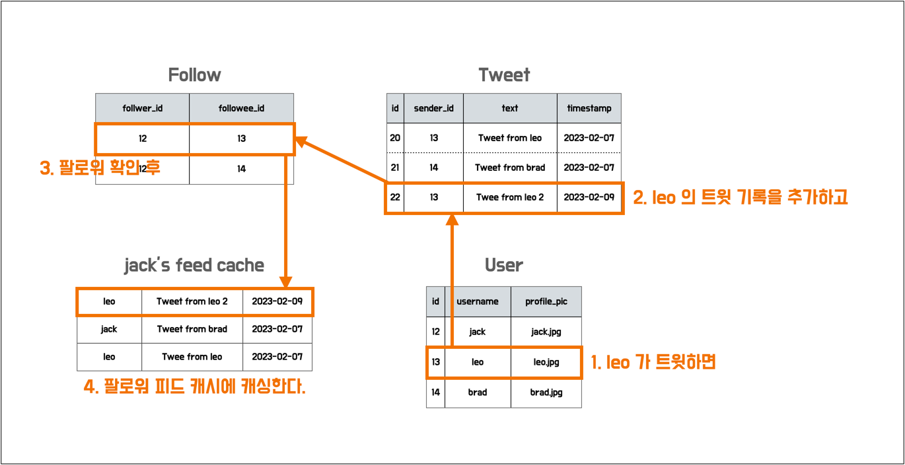

### 피드 요청
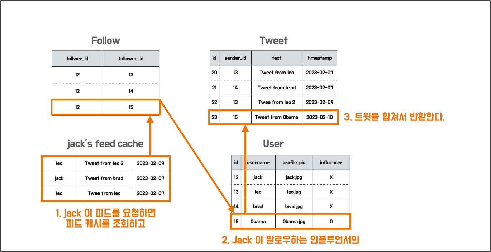

<br>

## 프로젝트 설정 및 테스트 환경

### 테스트 환경

- SpringBoot 2.7.8
- Kotlin 1.7
- JAVA 17
- mariadb 10.5.18
- redis 6.2.6
- CPU Apple M1 Pro / Memory 32GB / OS Ventura 13.1
- K6 v0.42.0

### 인프라

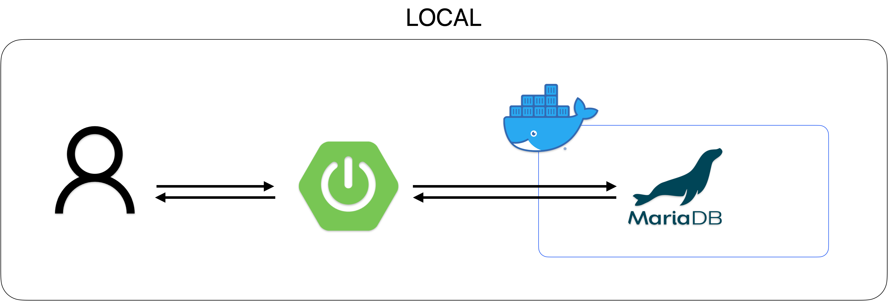

### 팔로워 관계


<br>

## 테스트 결과

### 피드 조회 성능 테스트

User A 와 User B 가 피드 조회를 요청한다.

> - VUser 1, 60 sec
> - GET /api/v1/feeds?user-id=10002 (User A)
> - GET /api/v1/feeds?user-id=10003 (User B)

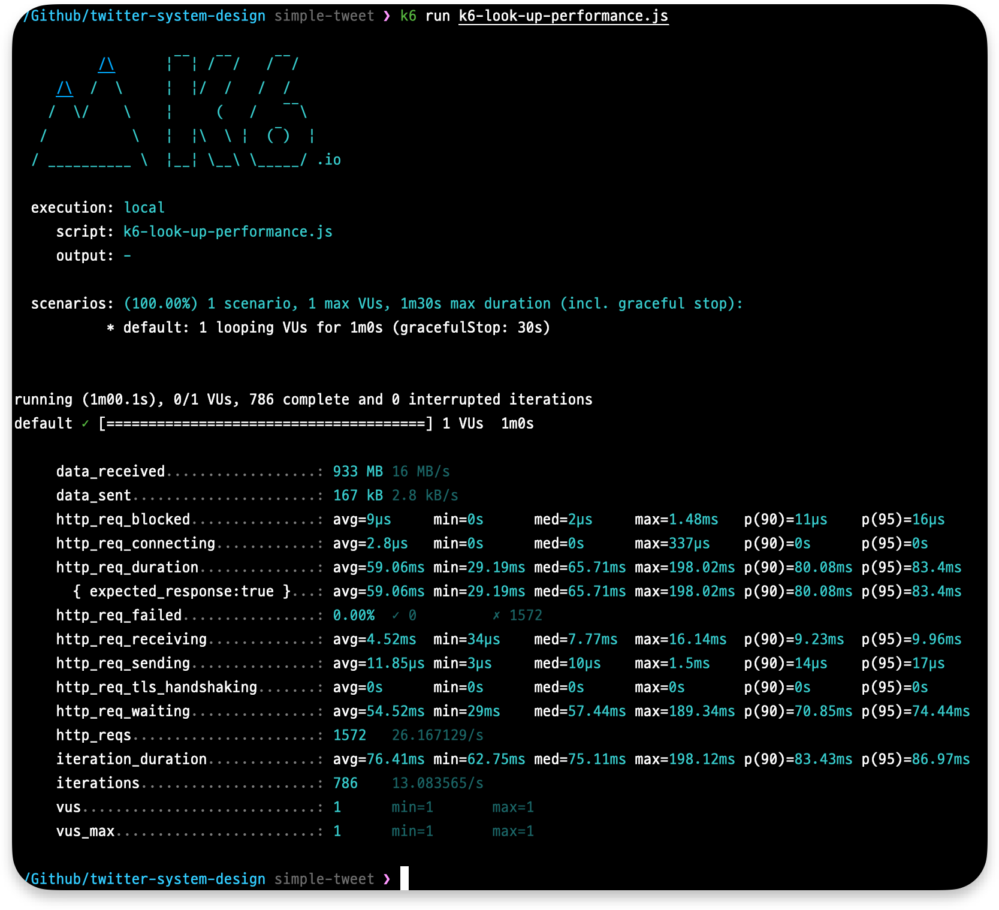
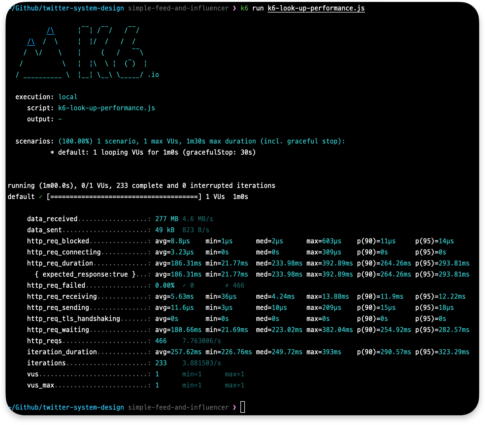
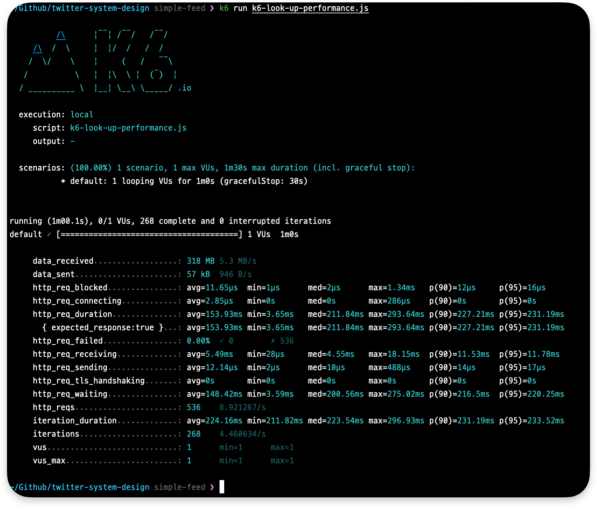

http_req_duration 평균 152.53ms (`(158.17 + 145.48 + 153.93) / 3`) 

simple-tweet 의 평균 58.43ms 보다 한참 느린 결과.  
redis lrange 명령어가 가지는 O(S+N) 시간복잡도 때문일 것으로 예상하고
ZSET 을 사용하여 테스트 재시도

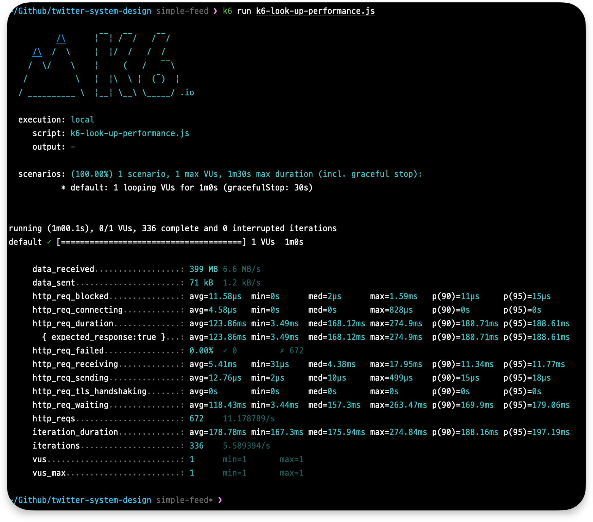

O(lg(N)+M) 시간 복잡도를 가진 ZSET 으로 테스트해보았으나 성능이 크게 개선되지 않음

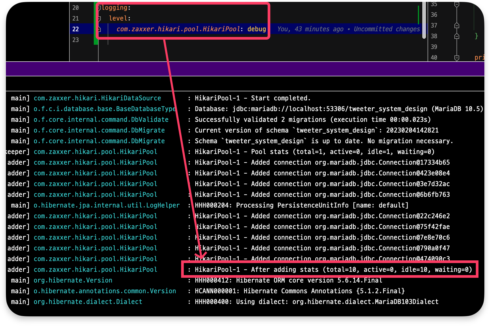

외부와 연결을 주고 받지 않는 로컬 환경의 한계와
~~HikariCP 의 기본 커넥션 풀이 10개와 redis 의 싱글 스레드 문제일 것으로 추측중...~~
2023-02-12 HikariCP 커넥션 풀 최대 개수를 3개로 줄여서 재실험 해보았으나 큰 차이가 없었음.
커넥션 풀로 인한 이상 현상은 아닌 것 같음.

### 트윗 직후 조회시 정합성 테스트

오바마를 팔로워중인 User 1 과 User 10,000 이 피드를 조회하던 중
오바마가 트윗을 했을 때 User 1 과 User 10,000 가 동일한 피드를 보고 있을 확률 테스트

> - VUser 1, 60 sec
> - GET /api/v1/feeds?user-id=1 (User 1)
> - GET /api/v1/feeds?user-id=10000 (User 10,000)
> - POST /api/v1/tweets (Obama tweet after 10 sec)

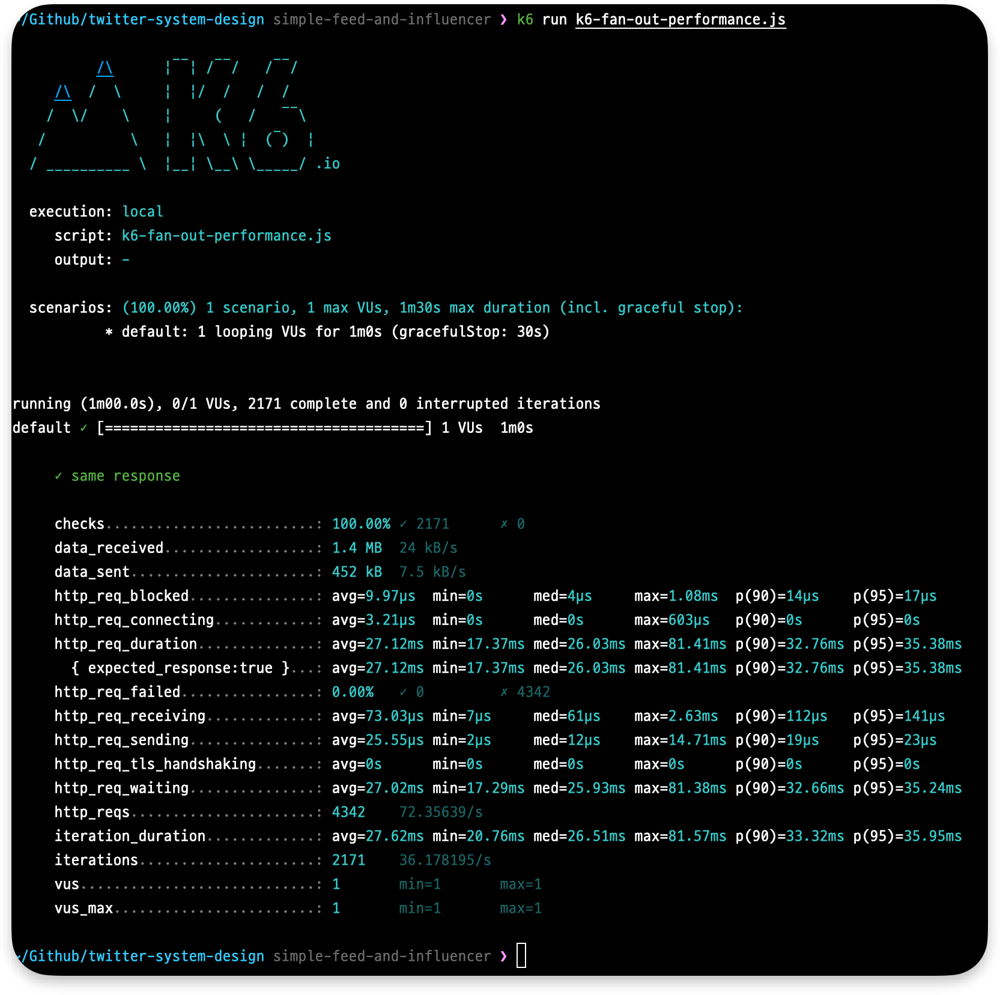
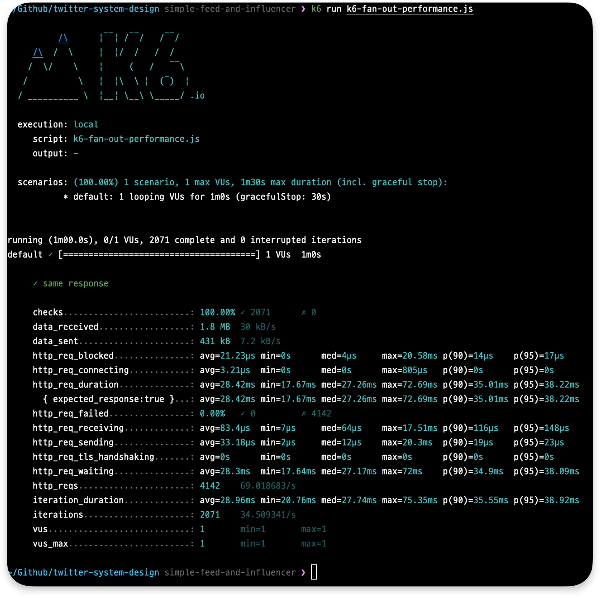
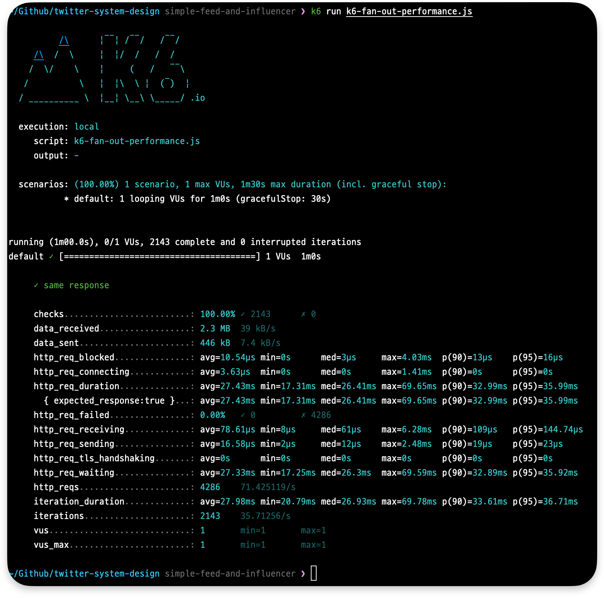

same response 71.67% (`(72 + 71 + 72) / 3`)  
28.33% 의 시간동안 한명은 오바마의 트윗을 확인하지 못하고 있음

<br>

> ## 2023-03-03 내용 추가
>
> JerryK026 님께서 댓글에 "mariadb 가 자동으로 hash 검색을 사용했기 때문에 빠르게 처리된것 아니냐" 라는 아이디어를 제공해주셨다.
> 이 때문에 비교를 위해 다시 테스트를 진행했는데, 기대에 부응하는 수치가 나왔다.
>
> 
>
> simple-tweet: 38.2ms
>
> 
>
> simple-feed: 36.97ms
>
> 
>
> simple-feed-and-influencer: 48.76ms
> (simple-feed-and-finluencer 같은 경우 일반 피드와 인플루언서 피드를 조립하는 과정이 추가되기 때문에 저정도 속도가 나오는 것으로 생각)
>
> 아무래도 이전 환경 세팅에 문제가 있었던 것 같다. 🤔
> 별개로 제공해주신 아이디어를 바탕으로 여러가지 가설을 세우고 확인해보았다.
>
> ## 가설 1. mariadb 가 index 탐색시 hash table을 이용했다.
> 우선 [mariadb storage engine index types](https://mariadb.com/kb/en/storage-engine-index-types/) 관련 문서를 확인해보았다.
> 문서에서는 mariadb 가 index types 으로 btree 를 사용하는 경우와 hash 를 사용하는 경우를 나열해주었는데, 기본적으로는 btree 를 사용하고 MEMORY 타입인 경우 hash 를 사용한다고 한다.
>
> >  BTREE is generally the default index type. For MEMORY tables, HASH is the default.
>
> flyway 를 통해 테이블을 생성할 때 별개 storage engine 을 명시하지 않았기 때문에 MEMORY 타입으로 테이블이 생성되었을 가능성을 염두에 두어 mysql 내부 설정을 확인해보았는데, 결과는 InnoDB 타입이었다.
>
> ```sql
> MariaDB [tweeter_system_design]> SELECT engine FROM information_schema.TABLES where table_name='tweet';
> +--------+
> | engine |
> +--------+
> | InnoDB |
> +--------+
> ```
>
> 또한 각 테이블들이 어떤 구조의 인덱스를 갖고 있는지 확인했다. 결과는 모두 btree 였다.
>
> ```sql
> MariaDB [tweeter_system_design]> show indexes from tweet;
> +-------+------------+----------+--------------+-------------+-----------+-------------+----------+--------+------+------------+---------+---------------+
> | Table | Non_unique | Key_name | Seq_in_index | Column_name | Collation | Cardinality | Sub_part | Packed | Null | Index_type | Comment | Index_comment |
> +-------+------------+----------+--------------+-------------+-----------+-------------+----------+--------+------+------------+---------+---------------+
> | tweet |          0 | PRIMARY  |            1 | id          | A         |        9926 |     NULL | NULL   |      | BTREE      |         |               |
> +-------+------------+----------+--------------+-------------+-----------+-------------+----------+--------+------+------------+---------+---------------+
>
> MariaDB [tweeter_system_design]> show indexes from follow;
> +--------+------------+----------+--------------+-------------+-----------+-------------+----------+--------+------+------------+---------+---------------+
> | Table  | Non_unique | Key_name | Seq_in_index | Column_name | Collation | Cardinality | Sub_part | Packed | Null | Index_type | Comment | Index_comment |
> +--------+------------+----------+--------------+-------------+-----------+-------------+----------+--------+------+------------+---------+---------------+
> | follow |          0 | PRIMARY  |            1 | followee_id | A         |       20137 |     NULL | NULL   |      | BTREE      |         |               |
> | follow |          0 | PRIMARY  |            2 | follower_id | A         |       20137 |     NULL | NULL   |      | BTREE      |         |               |
> +--------+------------+----------+--------------+-------------+-----------+-------------+----------+--------+------+------------+---------+---------------+
>
> MariaDB [tweeter_system_design]> show indexes from user;
> +-------+------------+----------+--------------+-------------+-----------+-------------+----------+--------+------+------------+---------+---------------+
> | Table | Non_unique | Key_name | Seq_in_index | Column_name | Collation | Cardinality | Sub_part | Packed | Null | Index_type | Comment | Index_comment |
> +-------+------------+----------+--------------+-------------+-----------+-------------+----------+--------+------+------------+---------+---------------+
> | user  |          0 | PRIMARY  |            1 | id          | A         |       10090 |     NULL | NULL   |      | BTREE      |         |               |
> +-------+------------+----------+--------------+-------------+-----------+-------------+----------+--------+------+------------+---------+---------------+
> ```
>
> 아쉽게도 가설 1 은 원인이 아니었음을 알게 되었다.
>
>
> ## 가설 2. Adaptive Hash Index 활용
>
> 조사 과정에서 [InnoDB의 Adaptive Hash Index 활용](https://tech.kakao.com/2016/04/07/innodb-adaptive-hash-index/)에 대해 알게 되었다. 
> 옵티마이저가 내부적으로 판단해서 자주 사용되는 데이터를 Adaptive Hash Index 를 통해 접근/처리를 한다고 한다.
>
> > ... 자주 사용되는 데이터 탐색에도 매번 트리의 경로를 쫓아가야 한다는 것이죠. 게다가 Mutex Lock이 과도하게 잡히게 되면, 적은 데이터 셋에도 불구하고 DB 자원 사용 효율이 떨어지게 됩니다.
>
> > InnoDB에서는 앞서 언급한 상황을 해결하기 위해, InnoDB Adative Hash Index 기능이 있습니다. 자주 사용되는 칼럼을 해시로 정의하여, B-Tree 를 타지 않고 바로 데이터에 접근할 수 있는 기능이죠. “Adaptive”라는 단어에서 예상할 수 있겠지만, 모든 값들이 해시로 생성이 되는 것이 아니라, 자주 사용되는 데이터 값만 내부적으로 판단하여 상황에 맞게 해시 값을 생성합니다.
>
> 실험에 사용된 mariadb 가 내부적으로 Adaptive Hash index 를 활용중인지 확인했으나, 결론은 아쉽게도 아니었다.
>
> ```sql
> MariaDB [tweeter_system_design]> show variables like '%adaptive%';
> +----------------------------------+-----------+
> | Variable_name                    | Value     |
> +----------------------------------+-----------+
> | innodb_adaptive_hash_index       | OFF       |
> | innodb_adaptive_hash_index_parts | 8         |
> | innodb_adaptive_max_sleep_delay  | 0         |
> +----------------------------------+-----------+
>
> MariaDB [tweeter_system_design]> show global status like 'Innodb_adaptive_hash%';
> +----------------------------------------+--------+
> | Variable_name                          | Value  |
> +----------------------------------------+--------+
> | Innodb_adaptive_hash_hash_searches     | 0      |
> | Innodb_adaptive_hash_non_hash_searches | 140975 |
> +----------------------------------------+--------+
> ```
>
> 아쉽게도 가설 2 또한 원인이 아니었음을 알게 되었다.
>
> 결론적으로 기존 테스트 환경이 잘못 설정되어 정상적이지 않은 수치가 나왔던 것 같다.
