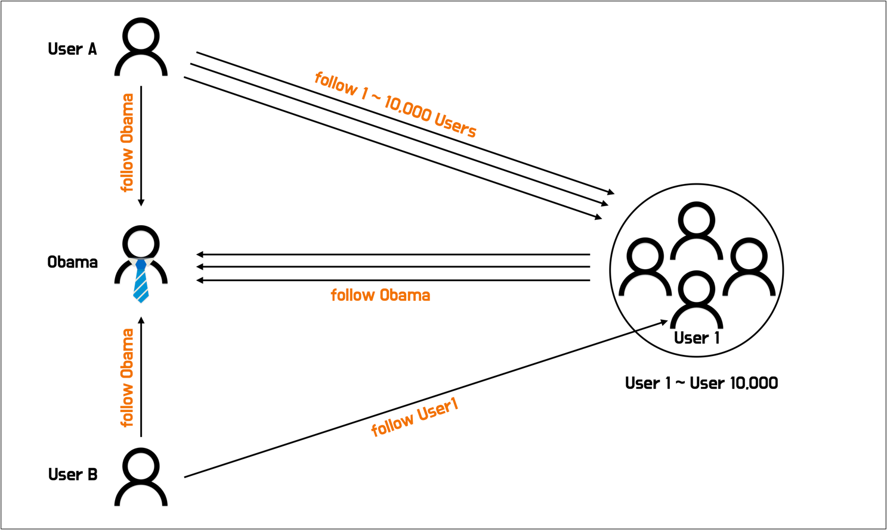
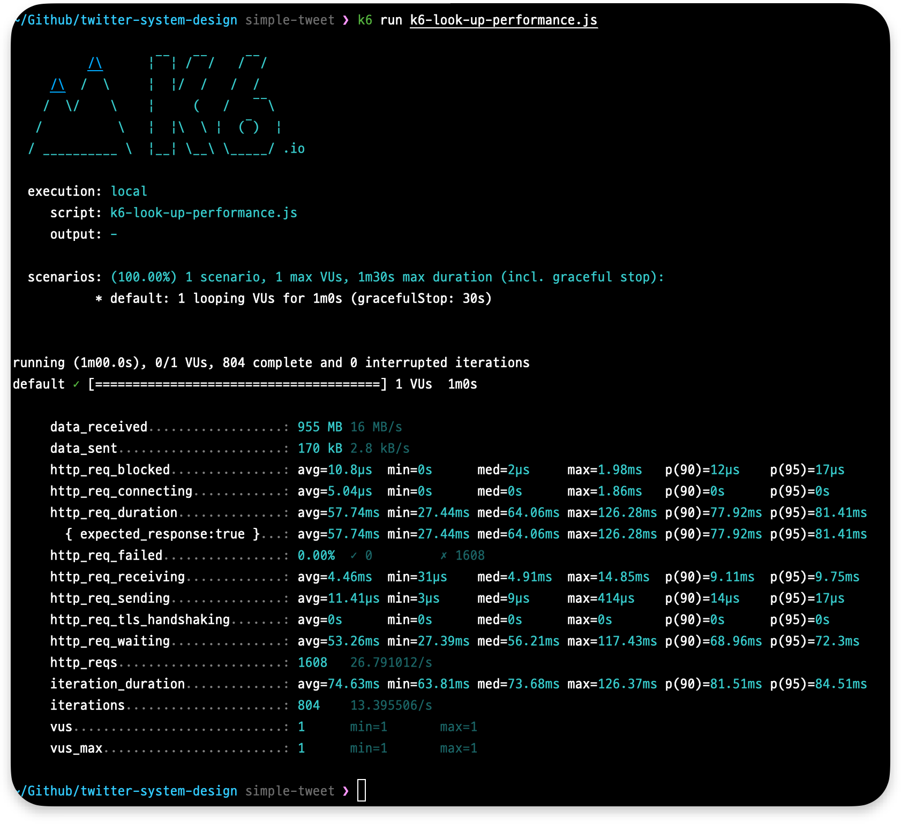
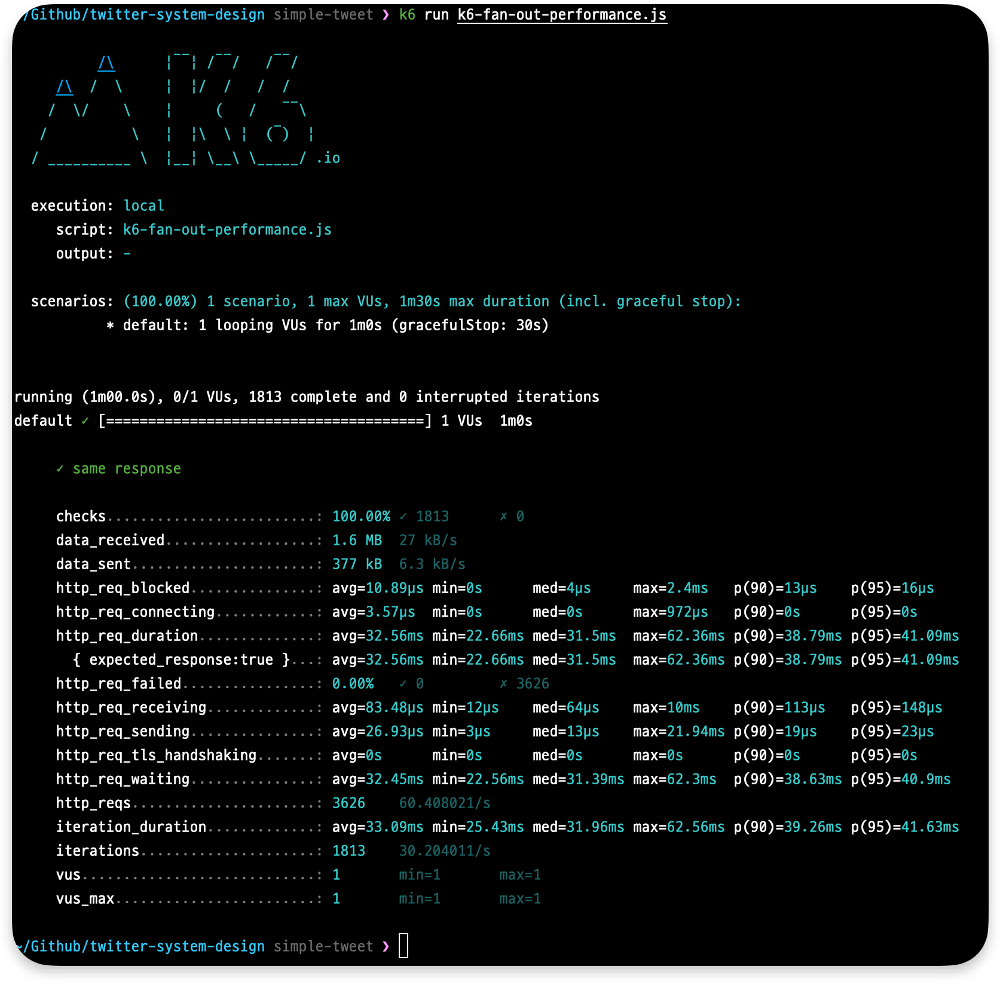

# 트위터 시스템 디자인 실험

실험기 글 링크 - [https://hyeon9mak.github.io/twitter-system-design-experiment](https://hyeon9mak.github.io/twitter-system-design-experiment)

## 소개

> [코맹탈출 채널의 트위터 시스템 디자인 완전정복 | 1억 유저 처리의 비밀](https://www.youtube.com/watch?v=6QwqtdBx0oE) 영상을 보고 간소하게 테스트 해본 내용입니다.

영상 내용에 따른 3가지 시스템 디자인을 브랜치 별로 나누어 두었습니다.

- [`simple-tweet`: 트윗 포스트를 간단하게 만들고, 피드 요청시 복잡성 처리](https://github.com/Hyeon9mak/twitter-system-design/tree/simple-tweet)
- [`simple-feed`: 피드 요청을 간단하게 만들고, 트윗 포스트시 복잡성 처리](https://github.com/Hyeon9mak/twitter-system-design/tree/simple-feed)
- [`simple-feed-and-influencer`: 피드 요청을 간단하게 만들고, 트윗 포스트시 복잡성 처리, 인플루언서 처리](https://github.com/Hyeon9mak/twitter-system-design/tree/simple-feed-and-influencer)

 

## 시스템 디자인 - 트윗 포스트를 간단하게 만들고, 피드 요청시 복잡성 처리

### 트윗 포스트

### 피드 요청

 

## 프로젝트 설정 및 테스트 환경

### 테스트 환경

- SpringBoot 2.7.8
- Kotlin 1.7
- JAVA 17
- mariadb 10.5.18
- redis 6.2.6
- CPU Apple M1 Pro / Memory 32GB / OS Ventura 13.1
- K6 v0.42.0

### 인프라

### 팔로워 관계

 

## 테스트 결과

### 피드 조회 성능 테스트

User A 와 User B 가 피드 조회를 요청한다.

> - VUser 1, 60 sec  
> - GET /api/v1/feeds?user-id=10002 (User A)  
> - GET /api/v1/feeds?user-id=10003 (User B)

http_req_duration 평균 58.43ms (`(57.74 + 58.49 + 59.06) / 3`) 

### 트윗 직후 조회시 정합성 테스트

오바마를 팔로워중인 User 1 과 User 10,000 이 피드를 조회하던 중 
오바마가 트윗을 했을 때 User 1 과 User 10,000 가 동일한 피드를 보고 있을 확률 테스트

> - VUser 1, 60 sec  
> - GET /api/v1/feeds?user-id=1 (User 1)  
> - GET /api/v1/feeds?user-id=10000 (User 10,000)  
> - POST /api/v1/tweets (Obama tweet after 10 sec)  

same response 100% (`(100 + 100 + 100) / 3`)
